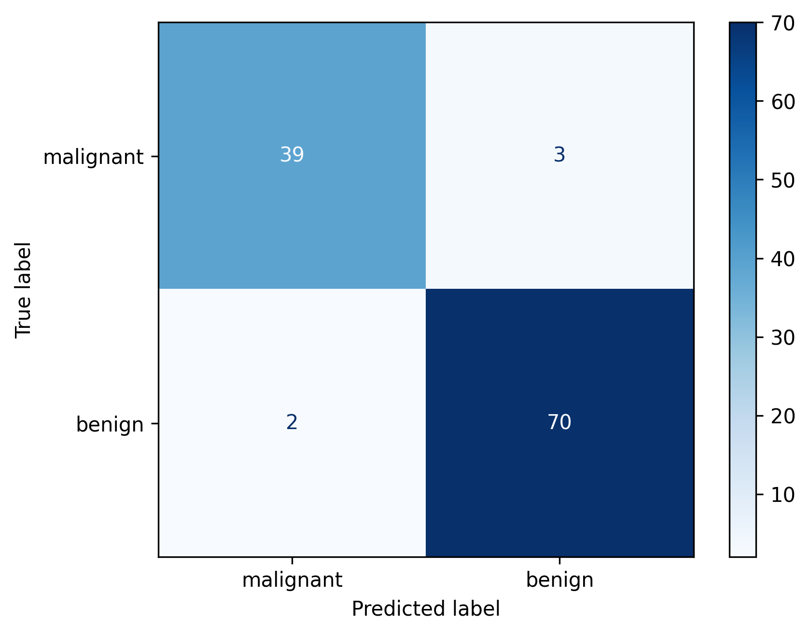

# 🩺 Cancer Prediction with Classical Machine‑Learning


A reproducible end‑to‑end ML workflow to classify malignant vs. benign breast tumours using the **Breast Cancer Wisconsin (Diagnostic) dataset**. This project walks through CSV ingestion → EDA → feature selection → model training & tuning → evaluation & persistence, resulting in **≈97% test recall** with Random Forest.

---

## 📊 Key Highlights

| Stage | What I did | Value delivered |
|-------|------------|-----------------|
| Exploratory Data Analysis | Analyzed distributions, correlations, and feature importances | Built intuition and guided modeling choices |
| Feature Selection | Compared full feature set vs. top-15 ranked by Gini importance | Validated that top-15 can match full-feature recall |
| Model zoo | Trained & tuned **Random Forest** and **SVC** using `GridSearchCV` | Demonstrated robust classical ML approach |
| Best model | **Random Forest (1 000 trees)** → 0.956 acc, 0.972 recall | High recall, interpretable, production‑ready |
| Evaluation | Exported confusion matrix and metrics JSON for tracking | Enables reproducibility and diagnostics |
| Production‑ready | Trained models saved as `.pkl`, CLI interface for inference | Ready for batch predictions and deployment |

## 🚀 Quick Start

```bash
# 1. Clone and enter the project
$ git clone https://github.com/atharva-m/cancer-prediction.git
$ cd cancer-prediction

# 2. Set up environment
$ python -m venv .venv && source .venv/bin/activate
$ pip install -r requirements.txt

# 3. Train best model (Random Forest)
$ python src/train.py --model rf

# Optional: use only top-15 features
$ python src/train.py --model rf --top15

# 4. Evaluate on held-out test set
$ python src/evaluate.py --model models/best_model.pkl

# 5. Predict on new samples
$ python src/predict.py --model models/best_model.pkl --input data/new_cases.csv --output predictions.csv
```

## 🗂️ Project Structure
```
├── data/              # raw and processed CSVs
├── notebooks/         # EDA & experimentation
├── src/
│   ├── train.py       # model training & tuning
│   ├── evaluate.py    # metrics & plots
│   └── predict.py     # batch / single inference
├── models/            # saved .pkl files
├── reports/           # confusion matrices, feature‑importance plot
└── README.md
```

## 🔬 Dataset
* **Breast Cancer Wisconsin (Diagnostic) – UCI ML Repository**
* 569 samples · 30 numeric features · Binary label (`diagnosis`: 0 = Benign, 1 = Malignant)
* No missing values; IDs removed prior to modelling

## 🏆 Results Summary

| Model | Accuracy | Precision | Recall | F1‑score |
|-------|----------|-----------|--------|----------|
| Random Forest (all features) | **95.61%** | 95.89% | **97.22%** ✅ | 96.55% |
| Random Forest (top‑15) | 93.86% | 94.52% | 95.83% | 95.17% |

All evaluation results are saved to `reports/metrics.json` and `confusion_matrix.png`.

## 🖼️ Confusion Matrix (Test Set)



## 📌 Top‑15 Features Used
```
1. mean radius
2. mean texture
3. mean perimeter
4. mean area
5. mean smoothness
6. mean compactness
7. mean concavity
8. mean concave points
9. mean symmetry
10. mean fractal dimension
11. radius error
12. texture error
13. perimeter error
14. area error
15. smoothness error
```

## ➕ Future Work
- Threshold tuning to further reduce false negatives
- Incorporate SHAP for feature-level explainability
- Docker + GitHub Actions for reproducible deployment
- Serve via FastAPI for real-time inference

## 🤝 Contributing
Pull requests are welcome. For major changes, please open an issue first to discuss what you would like to change.

## 📝 License
This project is licensed under the **Creative Commons Zero v1.0 Universal (CC0 1.0)** license — you can copy, modify, distribute, and use the work, even for commercial purposes, all without asking permission.

---

### Contact
Atharva Mokashi · atharvamokashi01@gmail.com · [LinkedIn](https://www.linkedin.com/in/atharva-m)
